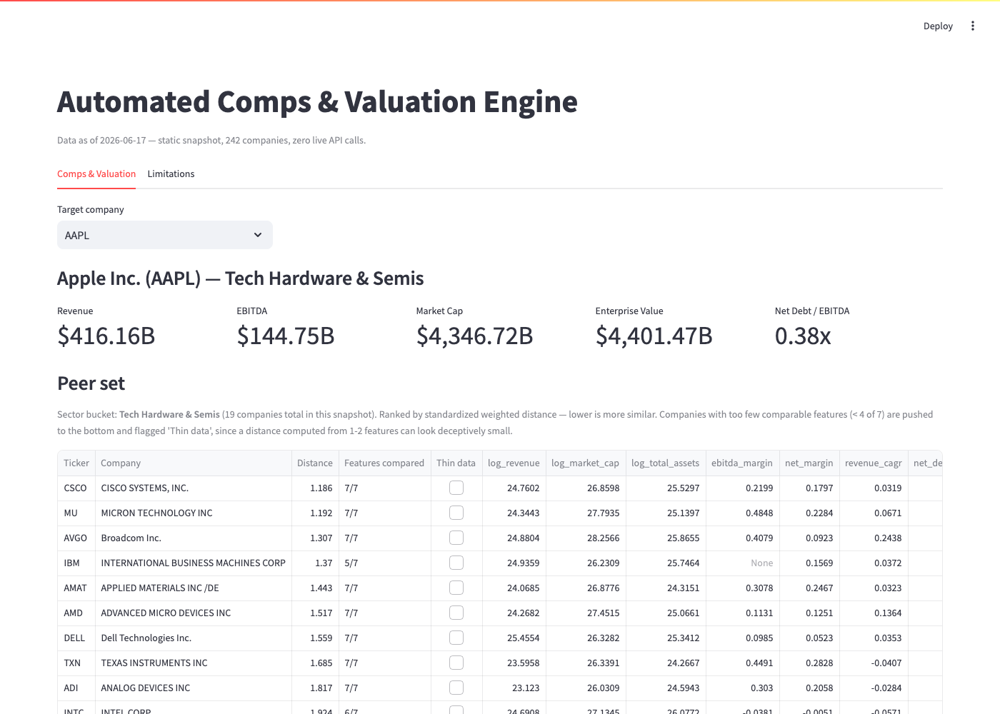
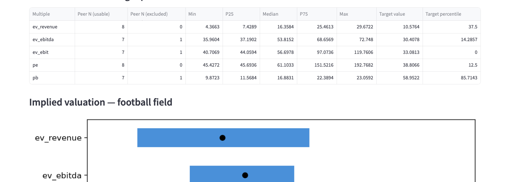

# Automated Comps & Valuation Engine

A deterministic, no-LLM comparable-company analysis tool: pick a target,
get a ranked peer set, see multiples benchmarked against the peer
distribution, and get an implied valuation range — the classic IB "comps"
workflow, automated end to end from public data.




## Data strategy

Two free, no-API-key sources, pulled once into a **static snapshot** so the
dashboard has zero runtime API dependency and zero rate-limit fragility:

1. **Fundamentals — SEC EDGAR `companyfacts` API.**
   `https://data.sec.gov/api/xbrl/companyfacts/CIK{10-digit-padded}.json`,
   with a mandatory descriptive `User-Agent` header. Used for revenue, net
   income, operating income, D&A, total debt, cash, shares outstanding,
   total assets, and book equity, extracted from the latest 10-K with full
   tag-fallback provenance (`src/ingest_edgar.py`).
2. **Prices / market cap — Yahoo Finance via `yfinance`.** EDGAR has no
   market prices at all, so this is a separate source, fetched in the same
   build run (`src/ingest_prices.py`).

`src/build_snapshot.py` runs both, normalizes, computes multiples, and
writes `data/snapshot/companies.json` + `meta.json`. The dashboard
(`app/dashboard.py`) only ever reads that JSON — peer ranking and implied
valuation are computed live from it (cheap, pure functions), but no
network call happens at dashboard runtime. Every page is stamped
"data as of {date}".

## Peer-similarity method (the intellectual core)

1. **Sector is a hard filter.** SIC codes are bucketed into ~17
   banker-recognizable sector groups (`src/peers.py:SIC_TO_SECTOR`) —
   hand-curated against the SIC codes actually present in
   `data/universe.csv`, not an official taxonomy. This single mapping is
   the biggest lever on peer quality (see LIMITATIONS.md §2).
2. **Within sector**, peers are ranked by a weighted Euclidean distance
   over a standardized (z-scored within the sector) feature vector: size
   (log revenue, log market cap, log total assets), profitability (EBITDA
   margin, net margin), growth (revenue CAGR), leverage (net debt/EBITDA).
3. Missing features are **excluded from the distance, never zero-filled**,
   and every company's `features_compared` count is surfaced. Candidates
   with fewer than 4 of 7 comparable features are flagged `thin_data` and
   ranked after fully-compared peers — this was a real bug caught during
   manual testing (TSM, with almost no EDGAR data, was initially ranking
   #1 peer for AAPL purely because two huge-market-cap companies look
   "close" on one shared dimension; see LIMITATIONS.md §8).
4. **Validation is soft and honest.** There's no ground truth for "the
   correct comp set." `src/validate_peers.py` checks model output against
   8 hand-labeled reference peer sets for well-known names. Current mean
   agreement: **90.6%**, with the misses documented, not hidden
   (LIMITATIONS.md §2).

## Multiples & valuation

EV/Revenue, EV/EBITDA, EV/EBIT, P/E, P/B. `EV = market cap + total debt -
cash`. Peer sets are aggregated by **median** (robust to outliers), with
the full min/p25/median/p75/max distribution reported and a 5%/95%
winsorization applied before aggregation. EV/EBITDA, EV/EBIT, P/E, and P/B
are **excluded** (not zero-filled or clipped) whenever the denominator is
non-positive or near-zero — see `src/multiples.py`.

`src/valuation.py` applies the peer's p25/median/p75 multiples to the
target's own metrics to produce a low/mid/high implied equity value per
multiple (the "football field"), and ranks the target's own multiple as a
percentile within its peer distribution.

## Run guide

```bash
cd comps-engine
python3 -m venv .venv && source .venv/bin/activate
pip install -r requirements.txt

# (re)build the snapshot — only needed if you change the universe or want
# fresh prices; the committed snapshot already has data as of the date
# stamped in data/snapshot/meta.json
python3 src/build_snapshot.py

# optional: soft peer-validation check
python3 src/validate_peers.py

# tests
python3 -m pytest tests/ -q

# dashboard
streamlit run app/dashboard.py
```

## Project structure

```
comps-engine/
  data/
    universe.csv            # seed: ticker, CIK, SIC code/description
    snapshot/                # generated static JSON (raw cache gitignored)
  src/
    edgar_map.py             # ticker -> CIK, SIC lookup
    ingest_edgar.py          # companyfacts fundamentals + tag fallback chains
    ingest_prices.py         # yfinance market cap / price
    normalize.py             # EBITDA reconstruction, debt aggregation, flags
    multiples.py             # EV/EBITDA, EV/Revenue, EV/EBIT, P/E, P/B
    peers.py                 # sector bucketing + weighted-distance ranking
    valuation.py              # peer-median implied range, percentile rank
    build_snapshot.py        # orchestrator -> data/snapshot/*.json
    validate_peers.py        # soft validation vs hand-labeled reference sets
  app/
    dashboard.py             # Streamlit UI
  tests/
  LIMITATIONS.md
```

## Portfolio metrics

- Universe size: **242 tickers** (target was 500-1,000; see
  LIMITATIONS.md §7 for why a smaller, curated universe was chosen)
- Peer-set agreement vs. hand-labeled reference sets: **90.6%** mean
  (8 names checked; see `data/snapshot/peer_validation.json`)
- Test count: **32 passing** (`pytest tests/ -q`)
- Multiples covered: EV/EBITDA, EV/Revenue, EV/EBIT, P/E, P/B
- Companies with a usable EV/EBITDA (positive, non-near-zero EBITDA):
  **169 / 242**
